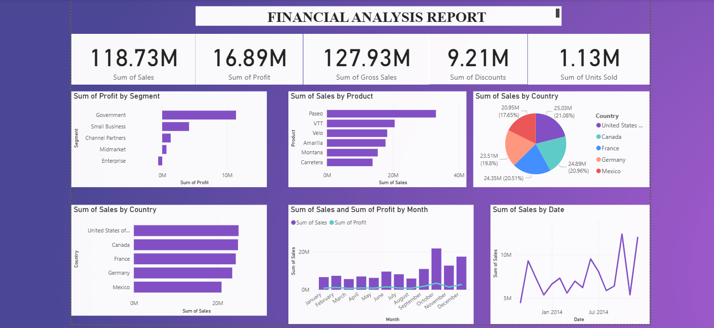

# 📊 Financial Analysis Dashboard

## 📌 Overview

The **Financial Analysis Dashboard** is an interactive Business Intelligence dashboard developed using **Microsoft Power BI**. It provides a comprehensive overview of financial performance by analyzing sales, profit, gross sales, discounts, units sold, product performance, country-wise sales, and monthly business trends using Microsoft's Financial Sample dataset.

This project demonstrates data visualization, KPI reporting, and dashboard design skills for business decision-making.

---

## 🎯 Objectives

* Analyze overall financial performance.
* Monitor sales, profit, and gross sales.
* Compare product and country-wise performance.
* Track monthly sales and profit trends.
* Present business insights through interactive visualizations.

---

## 🛠️ Tech Stack

* Microsoft Power BI
* Power Query
* DAX (Basic Measures)
* Microsoft Financial Sample Dataset

---

## 📈 Dashboard Features

### KPI Cards

* Total Sales
* Total Profit
* Gross Sales
* Total Discounts
* Units Sold

### Visualizations

* Profit by Business Segment
* Sales by Product
* Sales by Country (Pie Chart)
* Sales by Country (Bar Chart)
* Monthly Sales vs Profit Analysis
* Sales Trend by Date

---

## 📸 Dashboard Preview

### Complete Dashboard



### KPI Summary


### Charts & Analysis


---

## 📊 Dataset

**Dataset:** Microsoft Financial Sample Dataset

The Financial Sample dataset is a sample business dataset provided by Microsoft Power BI. It contains sales transactions across different countries, products, segments, and time periods, making it suitable for learning Business Intelligence and dashboard development.

---

## 💡 Key Business Insights

* Government segment generated the highest profit.
* Paseo is the highest-selling product.
* The United States contributed the largest share of total sales.
* Sales peaked during the final quarter of the year.
* KPI cards provide a quick overview of overall business performance.

---

## 🚀 Skills Demonstrated

* Data Visualization
* Dashboard Design
* Business Intelligence
* KPI Reporting
* Financial Data Analysis
* Trend Analysis
* Power BI Dashboard Development

---

## 📁 Project Structure

```text
Financial-Analysis-Dashboard
│
├── Financial Analysis Dashboard.pbix
├── README.md
│
└── images
    ├── dashboard-overview.png
    ├── dashboard-kpi.png
    ├── dashboard-charts.png
```

---

## 🔮 Future Improvements

* Add interactive slicers (Country, Product, Segment).
* Create drill-through pages for detailed analysis.
* Enhance dashboard with bookmarks and tooltips.
* Improve DAX measures for advanced KPI calculations.
* Publish the dashboard to Power BI Service.

---

## 👨‍💻 Author

**Syed Ayman T.**

B.Tech – Artificial Intelligence & Data Science
B.S. Abdur Rahman Crescent Institute of Science & Technology

Aspiring **Data Analyst | Data Scientist | AI/ML Engineer**

* GitHub: https://github.com/ayman-1707
* LinkedIn: https://www.linkedin.com/in/syed-ayman-3182083b7
* Email: [syedaymanthameem@gmail.com](mailto:syedaymanthameem@gmail.com)

